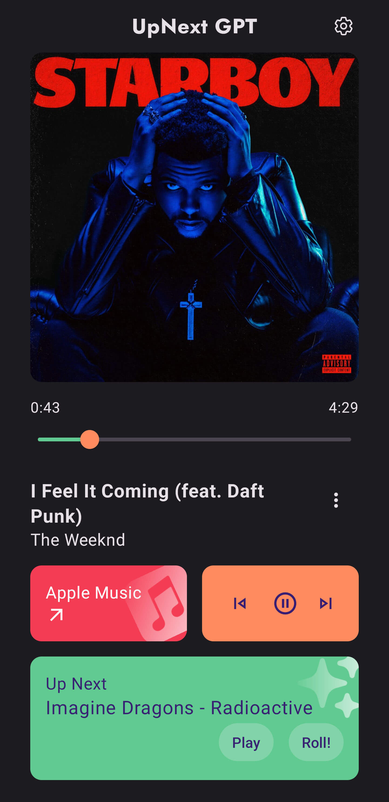
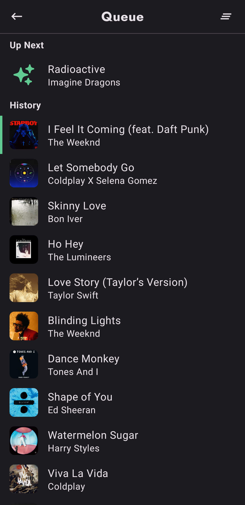

<div align="center">
    <h1>UpNext GPT</h1>
</div>


<p align="center">
    
</p>

Your playlist, powered by ChatGPT, fully open-sourced.

<a href="./images/screenshot-home.jpg"></a>
<a href="./images/screenshot-queue.jpg"></a>
<a href="./images/screenshot-settings.jpg"></a>

**The default API backend server is not currently available.**

**Please deploy your own API backend: [upnext-gpt-web](https://github.com/dokar3/upnext-gpt-web)**

# Features

- Recommend the next track using GPT
- Customizable API backend
- Control your players: Apple Music, Spotify, Youtube Music and more
- Play queue
- All UI written in Jetpack Compose

# Downloads

[Google Play](https://play.google.com/store/apps/details?id=com.dokar.upnextgpt)

[Github Releases](https://github.com/dokar3/upnext-gpt/releases)

# License

```
Copyright 2023 dokar3

Licensed under the Apache License, Version 2.0 (the "License");
you may not use this file except in compliance with the License.
You may obtain a copy of the License at

    http://www.apache.org/licenses/LICENSE-2.0

Unless required by applicable law or agreed to in writing, software
distributed under the License is distributed on an "AS IS" BASIS,
WITHOUT WARRANTIES OR CONDITIONS OF ANY KIND, either express or implied.
See the License for the specific language governing permissions and
limitations under the License.
```
